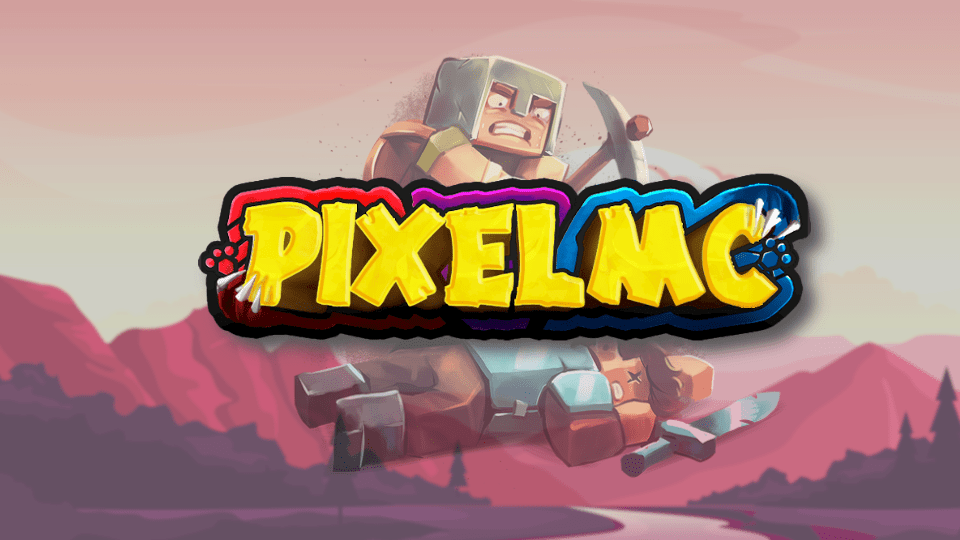

## <b>💥 中文页面!! : [README.md](README.md) 💥</b>

# <b>CustomSprays</b> | Fancy Spraying🎉

- " Just like source games'(hl,cs) spraying! "

## 📢Introduce & Download
___
> CustomSprays ~ Fancy Spraying
> 
> Allowing players upload image by url, and show them in the server !

## <b>Download</b>: [Releases](https://gitee.com/pixelmc/CustomSprays/releases)

<b>⭐ 1.17 and higher version is coming soon ⭐</b>

<b>⭐ English message config is also in config.yml (commented out by #) ⭐</b>

## Usage
___

<b>📡 Double click "F" to spray! </b>(the key exchanges items on you both hand)

    1 | Put "CustomSprays.jar" in "plugins" folder，restart the server.
      |
      | (now get ur image link)
      |
    2 | Send command: /cspray upload <url>  -  Upload image
    3 | Send command: /spray                -  Spray at wall
      |
    4 | 🎇 If server version ≥ 1.9，【Quick double click "F"】can also do the spray！🎇

> More commands send "/cspray"
> More configuration see "config.yml"

## 🎮Version Support
___
> ⭕ <b>Support after *TEST* </b> : 1.8 ~ 1.12 | 1.13 ~ 1.16

> ❌ <b>Working......</b> : ≥1.17

## 🏆Features
___

- 🙅‍ NO Bungeecord-side plugin，all the data storage in MySQL / yml

- 📦 All packet sending to achieve【no interact with spray | no generating "map_xxx.dat"】

- ☕ Don't need API，making NMS shit by my self（

- 🔗Player uploads link >> String storage image (image->base64) >> spray auto disappear

... *[已完善]* (~~Only support 128\*128px image~~) Save the image directly in 128*128

## ⚡Notices (actually BUGS)
___

> Known problems <b>*[In version 1.8~1.12]*</b>: When the map count is >32467 (max 32767 in a world), spraying will make some original map replaced by spray image.
>
>> <b>Reason:</b> Plugin use MapView id [32467~32767] to target the spray ...So map with that id will be replace.

## ✍TODO
___
- 1.17 is in progress！！

## 💖 & DONATE
___
This project is supporting by team [PixelMC](http://pixelmc.cn/)

If you have TONS OF MONEY pay us pay us pay us pay us pay us

... and we can do better then !

Wechat pay：
[图片]
Ali pay：
[图片]