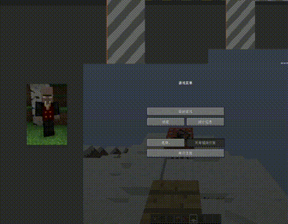

## <b>💥 English page!! : [README-EN.md](README-EN.md) 💥</b>

# <b>CustomSprays</b> | 花样喷漆🎉

- " 就像起源游戏(hl,cs) 的喷漆一样! "

## 📢介绍 & 下载
___
> CustomSprays ~ 花样喷漆
> 
> 允许玩家提供图片链接，在服务器中展示喷涂

## <b>下载</b>: [Releases](https://gitee.com/pixelmc/CustomSprays/releases)

<b>⭐ 1.17及以上版本 适配中 ⭐</b>

<b>⭐ 英文配置同样在 config.yml (被#注释) 中 ⭐</b>

## 用法
___

<b>📡 快速双击 "F" 喷漆! </b>(交换主副手的快捷键)

步骤:

    1 | 将 CustomSprays.jar 放入 plugins 文件夹，重启服务器
      |
      | (现在去复制图片链接)
      |
    2 | 输入指令: /cspray upload <url>  -  上传图片
    3 | 输入指令: /spray                -  对着墙喷漆
      |
    4 | 🎇 如果服务器版本 ≥ 1.9，【快速双击F键】也可以喷漆！🎇

> 更多指令发送 "/cspray"
> 更多设置请见 config.yml

## 🎮版本支持
___
> ⭕ <b>经 *测试* 后支持</b> : 1.8 ~ 1.12 | 1.13 ~ 1.16 

> ❌ <b>正在努力工作中......</b> : ≥1.17

## 🏆特性
___

- 🙅‍ 无 Bungeecord 端插件，所有数据皆由 MySQL / yml 进行存储

- 📦 纯发包实现喷漆【玩家无法交互 | 不生成map_xxx.dat】

- ☕ 无需前置API，发包纯手搓（

- 🔗 玩家上传图片链接 >> 文本存储图片 (image->base64) >> 喷漆后自动消失

... *[已完善]* (~~仅支持 128\*128px 图片~~) 保存数据时直接压缩图片到128*128大小

## ⚡注意事项
___

> 已知问题 <b>*[仅限版本1.8~1.12]*</b>：当某一世界地图数量 >32467 时 (世界地图最多为32767) 喷漆会导致某些原生地图被暂时替换
>
>> <b>原因:</b> 插件使用 MapView id [32467~32767] 对喷漆进行标识，在喷漆时可能会一并被发包上色

## ✍TODO
___
- 1.17 以上适配中！！

## 💖支持与捐赠
___
本项目由 [PixelMC](http://pixelmc.cn/) 团队提供长期支持与维护

如果您有能力，可以考虑捐献我们，帮助我们做得更好！

微信：
[图片]
支付宝：
[图片]